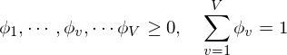
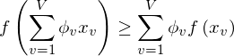

# jensens_inequality
イェンセンの不等式を式だけではなく図解できるようにプロットした

## イェンセンの不等式(Jensen's inequality)

機械学習分野でよく出てくる．

トピックモデルや行列因子分解(Non-negative Matrix Factorization)の補助関数法の基本的なアプローチである．

### 数式

を満たし， 関数f(x)が上に凸な関数であるとき，

が成り立つ．
